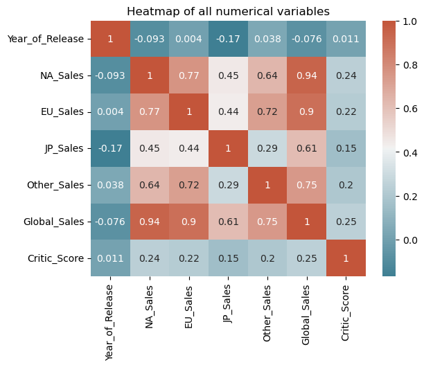
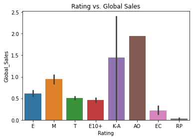
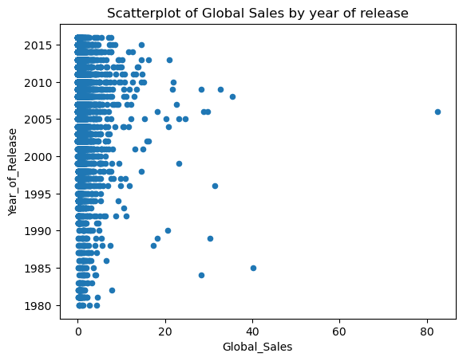
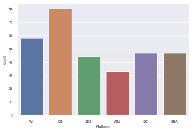
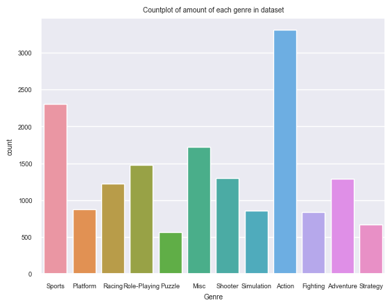
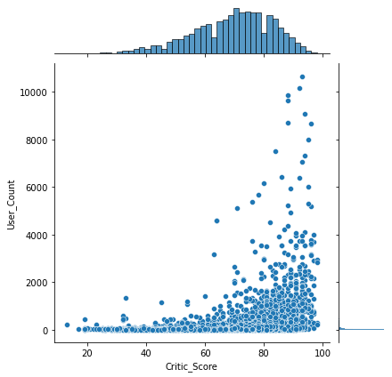

# Video Game Sales Analysis
By: Jeremy Adams, Beth Chesman, and Subaru Sakashita
## Introduction
Our project is an investigation into the video game sales dataset provided through [Kaggle](https://www.kaggle.com/datasets/rishidamarla/video-game-sales), however data.world is referenced to be the site where Sumit Kumar Shukla compiled the data. Within the file exists information and statistics on video games sold from 1980 to 2020 and includes platform, year of release, critic score, genre, global sales, etc. Essentially summarizing the games overall performance globally within sixteen columns, eight of which being strings. With this information, we wanted to explore various research questions fueled by our collective interest in video games as they were an elemental part of our childhood and continue to be a part of our lives both socially and emotionally. Given the chance to choose a topic that affects us and is familiar was really important and video games were that common ground. We delved into questions based on specific genre sales, how the passing of time has affected trends, specific region's trends, and more.

## Exploratory Data Analysis

Looking to see any trends in the data:

There is a large correlation between global sales and each other region specified. From observing this correlation chart, it seems like there is a slight scew towards NA and EU sales, with those having the largest correlation towards global sales as well as Critic Score. Interestingly, it seems like JP and NA and Global sales have a negative correlation with Year of Release. I'm not sure why this is, as I thought that games would have gotten more popular over the years.

This plot shows an unexpected relationship than what was previously expected. Aswell, we see there are a lot of missing values by the large error bars, so we know the data needs some cleaning later on. 

Games with a rating of AO (adults only) accumulate more sales, globally, than E (everyone) or even K-A (kids to adults). Keeping this in mind, over all the years our dataframe contains, it shows that the average consumers age (should) be closer to 18+, however younger kids playing games with the AO rating could effect these results. We can examine this trend closer by adding the release year to this comparison:

There seems to be a pretty even spread of sales over the years, with most games being in the 0 - 10 million range.

There are, however, quite a few outliers that go far beyond the expected range, especially one game in around 2006 that has sold over 80 million copies. It will be interesting to see what game that is.

It's seen through this plot that there's a lot more DS games than on other platforms and that WiiU has the least. However, there seems to be little difference between the rest of the platforms.

From this graph you can see the distribution of genres in the dataset.

It's interesting that Sports is so high, as I didn't think there were that many sports games.

It is, however, also a very subjective aspect of this dataset. Most of these games probably fall into more than just one category, or could arguably not even be in the category that it's listed as.

A better plot type could have been used to display this data because there's a lot of overlapping points, it's difficult to view all the data. However, there is a clear relationship between critic score and user count.