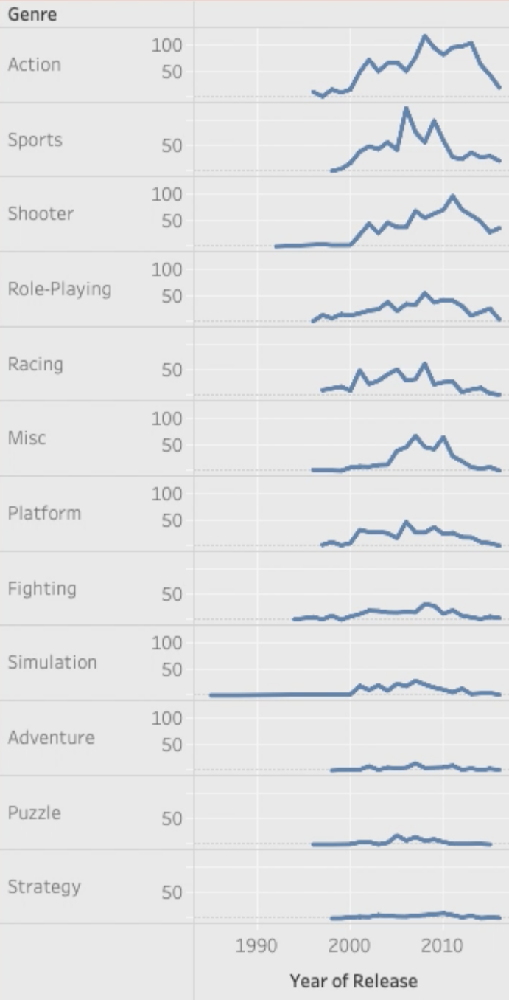

# Video Game Sales Analysis
By: Jeremy Adams, Beth Chesman, and Subaru Sakashita
## Introduction
Our project is an investigation into the video game sales dataset provided through [Kaggle](https://www.kaggle.com/datasets/rishidamarla/video-game-sales), however data.world is referenced to be the site where Sumit Kumar Shukla compiled the data. Within the file exists information and statistics on video games sold from 1980 to 2020 and includes platform, year of release, critic score, genre, global sales, etc. Essentially summarizing the games overall performance globally within sixteen columns, eight of which being strings. With this information, we wanted to explore various research questions fueled by our collective interest in video games as they were an elemental part of our childhood and continue to be a part of our lives both socially and emotionally. Given the chance to choose a topic that affects us and is familiar was really important and video games were that common ground. We delved into questions based on specific genre sales, how the passing of time has affected trends, specific region's trends, and more.

## Exploratory Data Analysis

Looking to see any trends in the data:

There is a large correlation between global sales and each other region specified. From observing this correlation chart, it seems like there is a slight scew towards NA and EU sales, with those having the largest correlation towards global sales as well as Critic Score. Interestingly, it seems like JP and NA and Global sales have a negative correlation with Year of Release. I'm not sure why this is, as I thought that games would have gotten more popular over the years.

This plot shows an unexpected relationship than what was previously expected. Aswell, we see there are a lot of missing values by the large error bars, so we know the data needs some cleaning later on. 

Games with a rating of AO (adults only) accumulate more sales, globally, than E (everyone) or even K-A (kids to adults). Keeping this in mind, over all the years our dataframe contains, it shows that the average consumers age (should) be closer to 18+, however younger kids playing games with the AO rating could effect these results. We can examine this trend closer by adding the release year to this comparison:

There seems to be a pretty even spread of sales over the years, with most games being in the 0 - 10 million range.

There are, however, quite a few outliers that go far beyond the expected range, especially one game in around 2006 that has sold over 80 million copies. It will be interesting to see what game that is.

It's seen through this plot that there's a lot more DS games than on other platforms and that WiiU has the least. However, there seems to be little difference between the rest of the platforms.

From this graph you can see the distribution of genres in the dataset.

It's interesting that Sports is so high, as I didn't think there were that many sports games.

It is, however, also a very subjective aspect of this dataset. Most of these games probably fall into more than just one category, or could arguably not even be in the category that it's listed as.

A better plot type could have been used to display this data because there's a lot of overlapping points, it's difficult to view all the data. However, there is a clear relationship between critic score and user count.

## Question 1
### What is the general trend for each platform? ###
To answer this question, we need to consider the global sales of each platform by year of release, and looking at the latest release year of each platform to analyze the general trend for each platform. The full analysis notebook of this research question and the code can be found [here](https://github.com/ubco-W2022T1-cosc301/project-group22/blob/main/notebooks/analysis1.ipynb)

The graph above shows the Plot of Global Sales by Year of Release for each Platform. As you can see, many platforms have increasing global sales in the beginning but they all start to decrease at a certain point. Some platforms have reached 0 like DC, and DS. 
Next, we need to look at why many platforms have reached 0. I am assuming this is because they have become outdated. 

The picture above shows the latest year of release for each platform. You can see the many platforms have stopped releasing games a while ago. So the reason behind platforms reaching 0 global sale is due to being outdated and the production of many new platforms. 
Although many platforms have become outdated, there is one old platform that is still existing which is PC. As you can see in the first picture, the PC games existed from 1900s. And they are still releasing games in 2016. Some platforms are also existing like PS4, 3DS but this is because they are relatively new. But these new platforms also have decreasing global sales and it would eventually reach 0.

Overall, many platforms have increasing global sale in the beginning but they began to decrease from a certain point. Some platforms have several fluctuations but most of them reached 0 eventually. This is because of the production of new platforms, and the old platforms have become outdated. An old platform, PC still exists today but the global sales is quite low compared to other new platforms. New platforms have higher global sales but similarly to other platforms, their global sales are decreasing from certain point and they would reach 0.

## Question 2
### Which platform libraries have the highest balance of average user scores and global sales? ###

To answer this question, we first need to create a new dataset containing each platform and their average Global Sales and average User Score.
We then need to drop any nan rows, and then create a new column for the "Score" that each platform gets. The score is determined by creating
a "relative score" for both Global Sales and User Score, and then adding them both together. The full notebook for this question as well as other questions
can be viewed [here](https://github.com/ubco-W2022T1-cosc301/project-group22/blob/main/notebooks/analysis2.ipynb).

The Relative Global Sales column is calculated simply by dividing each platform's Global Sales by the average Global Sales of all of them. The
same is also done for User Score. And then, like previously stated, the Total Score is calculated by simply adding the two relative values together.
Using this chart, we can now create a bar graph visualization to more easily view the results:

As you can see from this graph, neither the highest selling or the highest reviewing platform libraries in this dataset ended up with the top score. The highest scoring platform is the one with the most even balance of both, so the one that came out on top is the PS4. The Xbox 360, PS3, and Wii are also not far behind. It's interesting because something like the DreamCast, which has the highest average review score, ended up in the bottom half because it simply didn't sell that many games. Along with this, the Wii U, which doesn't have very high global sales, is still in a respectable position because of it's highly reviewed games. It would be interesting to see where the older consoles would fit on this graph, as they don't have any user scores recorded so we sadly couldn't include them.

## Question 3
### Were there certain time frames where particular genres were trending? ### 

To answer this question we'll have to consider the sales within each genre and the year of these sales, as well we'll take into account how many games are made of each genre. The full analysis notebook of this research question, along with the code can be found [here](https://github.com/ubco-W2022T1-cosc301/project-group22/blob/main/notebooks/analysis3.ipynb).

The upper right section of the plot shows clear peaks in genres, as well a general peak in sales overall. Globally, sports games have had a constant trend in popularity, however other genres like fighting have a high peak and immediate drop. These peaks were expected as games come in and out of popularity, but what are these trends consistent with? Do sports games come into demand around years the Olympics are hosted, for instance?

It's interesting seeing the distribution favouring sports and action so heavily since action games don't have a high peak in the previous pair plot, but sports games did have a high peak around the early 2000's. It will be interesting to see if action games have had more of a steady level of popularity rather than a short lived trend.

Knowing this plot is ordered by averaghe sales, it makes sense that the two genres with the most games have made up for the most sales. Seeing also that action is first is interesting because it doesn't neccesarily peak like sports does, this shows that action games are more than just a quick trend that burns out and is really the top genre overall. Sports has a couple big peaks, which are consistent with the initial pair plot and the rest of the genres are fairly consistent with the previous bar graph. Sports seem to peak around 2006 and 2009, these years are not compatible with our previous inquiry into sports games trending around the Olympics. It's thought-provoking questioning whether the game developers know their audience that well and make games consistent with what will sell or the users are simply buying what's being made and these trends are more-so being curated by the developers.

## Summary and Conclusions

